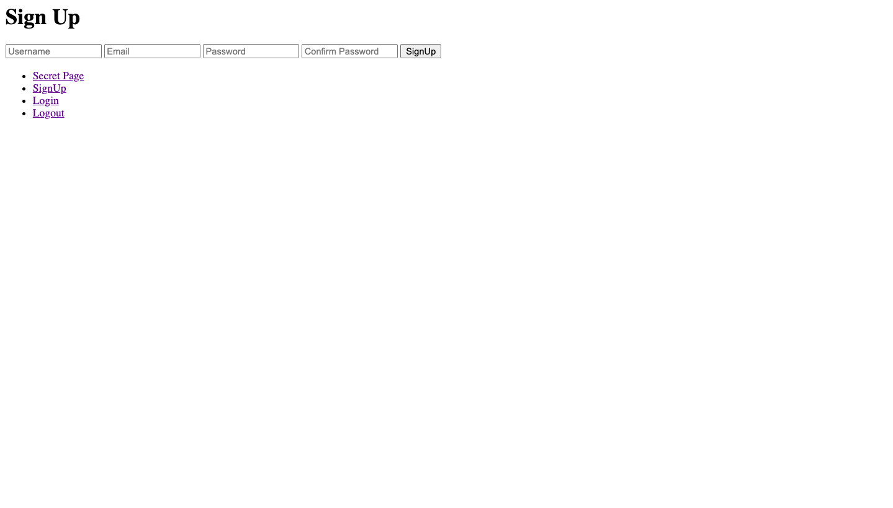

# express-custom-auth

Here **MongoDB**, **mongoose** and **passport** packages are used to implement a auth system in `Express`.

- Features
  - Sign In (using email)
  - Log In
  - Logout
  - Password reset
  - Protected routes

## Table of contents

- [Getting started](#getting-started)
- [Images](#images)
- [License](#license)

## Getting started

**Clone the repo and get in the dir**

```bash
git clone https://github.com/AkashSDas/express-custom-auth.git
cd express-custom-auth/
```

**Install dependencies**

```bash
npm install
```

**Start the server**

```bash
npm run dev
```

## Images





## License


